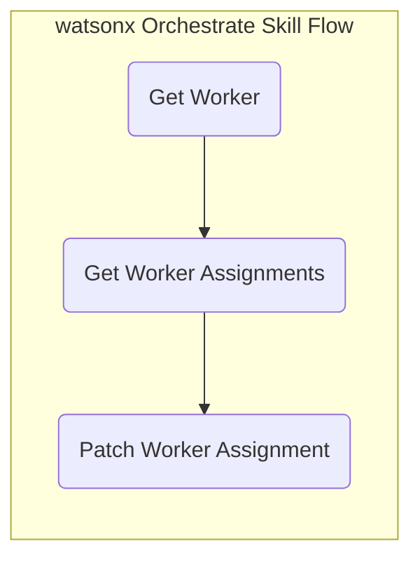

# Transfer an Employee Usecase

## Summary

The HR use case for transferring an employee involves moving an employee from one position, department, or location to another within the organization. This process includes updating job titles, responsibilities, and reporting structures, as well as managing any necessary adjustments to compensation, benefits, and training.

Value Statement: Automating employee transfers enhances efficiency by streamlining the updating of job roles, compensation, and reporting structures. This ensures a smooth transition with minimal manual intervention, reducing errors and improving employee experience and operational continuity.

IBM has successfuly implemented this usecase in IBM AskHR. The current customer POC's are in progress.

:::danger
This documentation is currently under construction. Refer to the flight log documentation to stay up to date on the development efforts or check back soon
:::

## Prerequisites

### IBM Technologies

1. IBM watsonx Orchestrate

### Supporting Technologies

1. Oracle HCM with access to "workers" API and ability to perform a PATCH function

## Quickstart

1. Upload the Oracle HCM API Spec under assets

2. Create a skill flow leveraging the API Spec as such:
  

3. Set the input parameters for each:
    1. Use the `workerId` output from "Get Worker" for input on "Get Worker Assignment"
    2. Use the `workerId` output from "Get Worker Assignments" for input on "Patch Worker Assignment"

:::note
Confirm with the customer if there are multiple assignments per worker. This documentation assumes 1 assignment per worker and will use/change the first assignment entry from `Get Worker Assignment`
:::

## Assets

1. Supporting Oracle HCM API (Skills)

:::warning
1. The below YAML is used to integrate with the IBM-owned Oracle HCM instance for use with pre-sales POC's
2. Source the `server` URL from IBM Internal documentation - denoted by "#######"
:::

:::danger
1. Path "publicWorker" API must be replaced with "worker" API. Currently, worker API is not exposed by IBM-owned Oracle HCM instance. The fix is in progress
2. API spec is not currently formatted to pass the watsonx Orchestrate validation requirements
:::

```
openapi: 3.0.3
info:
  title: HCM Rest API
  description: API to access employee resources in the HCM system.
  version: 1.0.0
servers:
  - url: ######
    description: HCM API server

paths:
  /hcmRestApi/resources/11.13.18.05/publicWorkers:
    get:
      summary: Get Employee Resources
      description: Retrieve a list of employee resources.
      operationId: getEmployeeResources
      parameters:
      - name: q
        in: query
        description: >
          This query parameter defines the where clause. The resource collection will be queried using the provided expressions. 
          The value of this query parameter is one or more expressions. 
          Example: `?q=Deptno>=10 and <= 30;Loc!=NY`
          
          Format: `?q=expression1;expression2`
          
          You can use these queryable attributes to filter this collection resource using the `q` query parameter:
          
          - `DisplayName`: string; Person's display name.
          - `FirstName`: string; Person's first name.
          - `LastName`; string; Person's last name.
          - `FullName`: string; Person's full name.
          - `KnownAs`: string; Person's preferred name.
          - `WorkEmail`: string; Person's work e-mail address.
        example: FirstName=Joe;DisplayName=Joe Root;WorkEmail=joe.root@trt.com
        required: false
        schema:
          type: string
      responses:
        '200':
          description: Successful response with a list of employee resources.
          content:
            application/json:
              schema:
                type: array
                items:
                  type: object
                  properties:
                    PersonId:
                      type: integer
                      description: Employee ID
                    WorkEmail:
                      type: string
                      description: Employee name
                    DisplayName:
                      type: string
                      description: Employee name
        '400':
          description: Bad Request.
        '401':
          description: Unauthorized - invalid credentials.
        '500':
          description: Internal Server Error - unexpected error.
      security:
        - basicAuth: []

  /hcmRestApi/resources/11.13.18.05/publicWorkers/{workerId}/child/assignments:
    get:
      summary: Get Employee Assignments
      description: Retrieve a list of assignments for an employee.
      operationId: getEmployeeAssignments
      parameters:
        - name: workerId
          in: path
          required: true
          description: The ID of the worker for whom to retrieve assignments.
          schema:
            type: string
      responses:
        '200':
          description: Successful response with a list of employee assignments.
          content:
            application/json:
              schema:
                 $ref: '#/components/schemas/GetEmployeeAssignmentsResponse'
        '400':
          description: Bad Request.
        '401':
          description: Unauthorized - invalid credentials.
        '500':
          description: Internal Server Error - unexpected error.
      security:
        - basicAuth: []
  /hcmRestApi/resources/11.13.18.05/publicWorkers/{workerId}/child/assignments/{assignmentId}:
    patch:
      summary: Update an Employee Assignment
      description: Update an assignment of an employee.
      operationId: updateEmployeeAssignment
      parameters:
        - name: workerId
          in: path
          required: true
          description: The ID of the worker for whom to update assignments.
          schema:
            type: string
        - name: assignmentId
          in: path
          required: true
          description: The ID of the assignment to update.
          schema:
            type: string
        - name: effective-Of
          in: header
          required: true
          description: >
            This header specifies the effective date range for the update operation. 
            Example: `RangeMode=UPDATE;RangeStartDate=2019-09-11;RangeEndDate=4712-12-31`
          schema:
            type: string
            example: RangeMode=UPDATE;RangeStartDate=2019-09-11;RangeEndDate=4712-12-31
      requestBody:
        description: The assignment details to be updated.
        required: true
        content:
          application/json:
            schema:
              type: object
              properties:
                ActionCode:
                  type: string
                  description: The action code related to the assignment update.
                  default: "TRANSFER"
                ReasonCode:
                  type: string
                  description: The reason code for the assignment update.
                LocationId:
                  type: string
                  description: The ID of the location associated with the assignment.
            example:
              ActionCode: "TRANSFER"
              ReasonCode: "LOCCHANGE"
              LocationId: "300100073991592"
      responses:
        '200':
          description: Successfully updated
          content:
            application/json: {}
        '400':
          description: Bad Request.
        '401':
          description: Unauthorized - invalid credentials.
        '403':
          description: Forbidden.
        '500':
          description: Internal Server Error - unexpected error.
      security:
        - basicAuth: []
components:
  schemas:
    GetEmployeeAssignmentsResponse:
      type: object
      properties:
        items:
          type: array
          items:
            type: object
            properties:
              AssignmentId:
                type: integer
                description: The unique identifier for the assignment
  securitySchemes:
    basicAuth:
      type: http
      scheme: basic
```
## References
