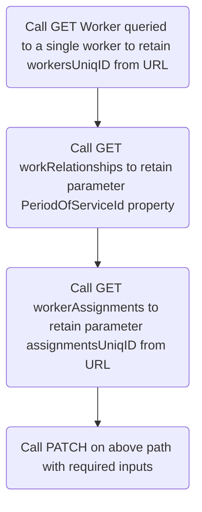
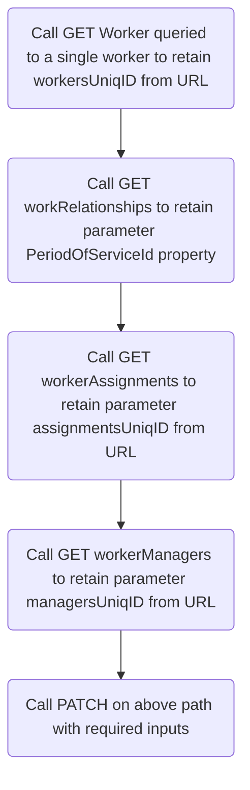

# Transfer an Employee Usecase

## Summary

The HR use case for transferring an employee involves moving an employee from one position, department, or location to another within the organization. This process includes updating job titles, responsibilities, and reporting structures, as well as managing any necessary adjustments to compensation, benefits, and training.

Value Statement: Automating employee transfers enhances efficiency by streamlining the updating of job roles, compensation, and reporting structures. This ensures a smooth transition with minimal manual intervention, reducing errors and improving employee experience and operational continuity.

IBM has successfuly implemented this usecase in IBM AskHR. The current customer POC's are in progress.

:::danger
This documentation is currently under construction. Refer to the flight log documentation to stay up to date on the development efforts or check back soon
:::

## Prerequisites

### IBM Technologies

1. IBM watsonx Orchestrate

### Supporting Technologies

1. Oracle HCM with GET access to "workers" API and ability to perform a PATCH functions

## Process Flows

Each proces flow requires the parsing of the unique values of
1. Employee ID
2. Worker Assignment
3. Worker Manager
To obtain these, you must follow the chain of URLs returned from the GET worker call

:::warning
This documentation assumes that for each worker there is a single assignment and a single manager
:::

### Transfer a Worker

Refer to the [Oracle HCM "Transfer a Worker" Documentation](https://docs.oracle.com/en/cloud/saas/human-resources/24b/farws/Transfer_a_Worker.html)

Oracle HCM API PATCH Path

`/hcmRestApi/resources/11.13.18.05/workers/{workersUniqID}/child/workRelationships/{PeriodOfServiceId}/child/assignments/{assignmentsUniqID}`

#### Process Flow



Example PATCH Input to transfer an employee's location:

```json
{
"ActionCode": "TRANSFER",
"ReasonCode": "LOCCHANGE",
"LocationId":"300100073991592"
}
```
### Update a Manager

Similarly, to update a manager, it requires the above children URLs and goes one child further to update an employee's manager

Refer to the [Oracle HCM "Update a Manager" Documentation](https://docs.oracle.com/en/cloud/saas/human-resources/24c/farws/Update_a_Worker_Manager.html)

Oracle HCM API PATCH Path:

`/hcmRestApi/resources/11.13.18.05/workers/{workersUniqID}/child/workRelationships/{PeriodOfServiceId}/child/assignments/{assignmentsUniqID}/child/managers/{managersUniqID}`

#### Process Flow



Example PATCH Input to change an employee's manager:

```json
{
"ActionCode": "MANAGER_CHANGE",
"ManagerAssignmentNumber": "E955160008191552",
"ManagerType": "LINE_MANAGER"
}
```

## Assets

[Transer Worker YAML](../../assets/usecases/transferworker/transferworker.yaml)

:::warning
1. The below YAML is used to integrate with the IBM-owned Oracle HCM instance for use with pre-sales POC's
2. Source the `server` URL from IBM Internal documentation - denoted by "#######"
3. The query parameters must be set per the yaml comments or left blank
4. The input parameters must match the above example's format
:::

:::danger
This yaml cannot be imported to watsonx Orchestrate directly, as it does not include all watsonx Orchestrate required properties
:::

```yaml
openapi: 3.0.3
info:
  title: HCM Rest API
  description: API to access employee resources in the HCM system.
  version: 1.0.0
servers:
  - url: ######
    description: HCM API server

paths:
  /hcmRestApi/resources/11.13.18.05/workers:
    get:
      summary: Get Employee Resources
      description: Retrieve a list of employee resources.
      operationId: getEmployeeResources
      parameters:
        - name: q
          in: query
          description: >
            This query parameter defines the where clause. The resource collection will be queried using the provided expressions. 
            The value of this query parameter is one or more expressions. 
            Example: `?q=Deptno>=10 and Deptno<=30;Loc!=NY`
            
            Format: `?q=expression1;expression2`
            
            You can use these queryable attributes to filter this collection resource using the `q` query parameter:
            
            - `DisplayName`: string; Person's display name.
            - `FirstName`: string; Person's first name.
            - `LastName`: string; Person's last name.
            - `FullName`: string; Person's full name.
            - `KnownAs`: string; Person's preferred name.
            - `WorkEmail`: string; Person's work e-mail address.
          example: FirstName=Joe;DisplayName=Joe Root;WorkEmail=joe.root@trt.com
          required: false
          schema:
            type: string
      responses:
        '200':
          description: Successful response with a list of employee resources.
        '400':
          description: Bad Request
        '401':
          description: Unauthorized - invalid credentials
        '500':
          description: Internal Server Error - unexpected error
      security:
        - basicAuth: []

  /hcmRestApi/resources/11.13.18.05/workers/{workersUniqID}/child/workRelationships:
    get:
      summary: Get Employee Work Relationships
      description: Retrieve a list of work relationships for an employee.
      operationId: getEmployeeWorkRelationships
      parameters:
        - name: workersUniqID
          in: path
          required: true
          description: The ID of the worker for whom to retrieve work relationships.
          schema:
            type: string
      responses:
        '200':
          description: Successful response with a list of employee work relationships.
        '400':
          description: Bad Request
        '401':
          description: Unauthorized - invalid credentials
        '500':
          description: Internal Server Error - unexpected error
      security:
        - basicAuth: []

  /hcmRestApi/resources/11.13.18.05/workers/{workersUniqID}/child/workRelationships/{PeriodOfServiceId}/child/assignments/:
    get:
      summary: Get Employee Assignments
      description: Retrieve a list of assignments for an employee within a specified work relationship period.
      operationId: getEmployeeAssignments
      parameters:
        - name: workersUniqID
          in: path
          required: true
          description: The ID of the worker for whom to retrieve assignments.
          schema:
            type: string
        - name: PeriodOfServiceId
          in: path
          required: true
          description: The ID of the period of service for which to retrieve assignments.
          schema:
            type: string
      responses:
        '200':
          description: Successful response with a list of employee assignments.
        '400':
          description: Bad Request
        '401':
          description: Unauthorized - invalid credentials
        '500':
          description: Internal Server Error - unexpected error
      security:
        - basicAuth: []

  /hcmRestApi/resources/11.13.18.05/workers/{workersUniqID}/child/workRelationships/{PeriodOfServiceId}/child/assignments/{assignmentsUniqID}/child/managers/:
    get:
      summary: Get Employee Managers
      description: Retrieve a list of managers for a specific assignment of an employee.
      operationId: getEmployeeManagers
      parameters:
        - name: workersUniqID
          in: path
          required: true
          description: The ID of the worker for whom to retrieve managers.
          schema:
            type: string
        - name: PeriodOfServiceId
          in: path
          required: true
          description: The ID of the period of service to retrieve managers.
          schema:
            type: string
        - name: assignmentsUniqID
          in: path
          required: true
          description: The ID of the assignment to retrieve managers.
          schema:
            type: string
      responses:
        '200':
          description: Successful response with a list of managers for the specified assignment.
        '400':
          description: Bad Request
        '401':
          description: Unauthorized - invalid credentials
        '500':
          description: Internal Server Error - unexpected error
      security:
        - basicAuth: []

  /hcmRestApi/resources/11.13.18.05/workers/{workersUniqID}/child/workRelationships/{PeriodOfServiceId}/child/assignments/{assignmentsUniqID}:
    patch:
      summary: Update an Employee Assignment
      description: Update an assignment for an employee within a specified work relationship period.
      operationId: updateEmployeeAssignment
      parameters:
        - name: workersUniqID
          in: path
          required: true
          description: The unique ID of the worker for whom to update the assignment.
          schema:
            type: string
        - name: PeriodOfServiceId
          in: path
          required: true
          description: The unique ID of the period of service for which to update the assignment.
          schema:
            type: string
        - name: assignmentsUniqID
          in: path
          required: true
          description: The unique ID of the assignment to update.
          schema:
            type: string
      requestBody:
        description: The assignment details to be updated.
        required: true
        content:
          application/json:
            schema:
              type: object
              properties:
                ActionCode:
                  type: string
                  description: The action code related to the assignment update.
                ReasonCode:
                  type: string
                  description: The reason code for the assignment update.
                LocationId:
                  type: string
                  description: The ID of the new location for the assignment.
            example:
              ActionCode: "TRANSFER"
              ReasonCode: "LOCCHANGE"
              LocationId: "300100073991592"
      responses:
        '200':
          description: Successfully updated assignment
        '400':
          description: Bad Request
        '401':
          description: Unauthorized - invalid credentials
        '403':
          description: Forbidden
        '500':
          description: Internal Server Error - unexpected error
      security:
        - basicAuth: []

  /hcmRestApi/resources/11.13.18.05/workers/{workersUniqID}/child/workRelationships/{PeriodOfServiceId}/child/assignments/{assignmentsUniqID}/child/managers/{managersUniqID}:
    patch:
      summary: Update an Employee Manager
      description: Update a manager assignment of an employee.
      operationId: updateEmployeeManager
      parameters:
        - name: workersUniqID
          in: path
          required: true
          description: The unique ID of the worker for whom to update the manager.
          schema:
            type: string
        - name: PeriodOfServiceId
          in: path
          required: true
          description: The unique ID of the period of service for which to update the manager.
          schema:
            type: string
        - name: assignmentsUniqID
          in: path
          required: true
          description: The unique ID of the assignment for which to update the manager.
          schema:
            type: string
        - name: managersUniqID
          in: path
          required: true
          description: The unique ID of the manager to update.
          schema:
            type: string
        - name: RangeHeader
          in: header
          required: true
          description: >
            This header specifies the effective date range for the update operation. 
            Example: `RangeMode=UPDATE;RangeStartDate=2019-09-11;RangeEndDate=4712-12-31`
          schema:
            type: string
            example: RangeMode=UPDATE;RangeStartDate=2019-09-11;RangeEndDate=4712-12-31
      requestBody:
        description: The manager details to be updated.
        required: true
        content:
          application/json:
            schema:
              type: object
              properties:
                ActionCode:
                  type: string
                  description: The action code related to the manager update.
                  default: "MANAGER_CHANGE"
                ManagerAssignmentNumber:
                  type: string
                  description: The assignment number of the new manager.
                ManagerType:
                  type: string
                  description: The type of the manager (e.g., LINE_MANAGER).
            example:
              ActionCode: "MANAGER_CHANGE"
              ManagerAssignmentNumber: "E955160008191552"
              ManagerType: "LINE_MANAGER"
      responses:
        '200':
          description: Successfully updated manager assignment
        '400':
          description: Bad Request
        '401':
          description: Unauthorized - invalid credentials
        '403':
          description: Forbidden
        '500':
          description: Internal Server Error - unexpected error
      security:
        - basicAuth: []

components:
  securitySchemes:
    basicAuth:
      type: http
      scheme: basic
```

### Example Outputs

#### Get Worker
```json
{
  "items": [
    {
      "PersonId": 300000009681193,
      "PersonNumber": "19",
      "CorrespondenceLanguage": null,
      "BloodType": null,
      "DateOfBirth": null,
      "DateOfDeath": null,
      "CountryOfBirth": null,
      "RegionOfBirth": null,
      "TownOfBirth": null,
      "ApplicantNumber": null,
      "CreatedBy": "rkswain@in.ibm.com",
      "CreationDate": "2024-08-18T08:19:18+00:00",
      "LastUpdatedBy": "rkswain@in.ibm.com",
      "LastUpdateDate": "2024-08-18T08:25:52.593+00:00",
      "links": [
        {
          "rel": "self",
          "href": "https://iavnqy-dev1.fa.ocs.oraclecloud.com:443/hcmRestApi/resources/11.13.18.05/workers/00020000000EACED00057708000110D9320279290000004AACED00057372000D6A6176612E73716C2E4461746514FA46683F3566970200007872000E6A6176612E7574696C2E44617465686A81014B5974190300007870770800000191E387980078",
          "name": "workers",
          "kind": "item",
          "properties": {
            "changeIndicator": "ACED0005737200136A6176612E7574696C2E41727261794C6973747881D21D99C7619D03000149000473697A65787000000002770400000002737200116A6176612E6C616E672E496E746567657212E2A0A4F781873802000149000576616C7565787200106A6176612E6C616E672E4E756D62657286AC951D0B94E08B0200007870000000027371007E00020000000178"
          }
        },
        {
          "rel": "canonical",
          "href": "https://iavnqy-dev1.fa.ocs.oraclecloud.com:443/hcmRestApi/resources/11.13.18.05/workers/00020000000EACED00057708000110D9320279290000004AACED00057372000D6A6176612E73716C2E4461746514FA46683F3566970200007872000E6A6176612E7574696C2E44617465686A81014B5974190300007870770800000191E387980078",
          "name": "workers",
          "kind": "item"
        },
        {
          "rel": "child",
          "href": "https://iavnqy-dev1.fa.ocs.oraclecloud.com:443/hcmRestApi/resources/11.13.18.05/workers/00020000000EACED00057708000110D9320279290000004AACED00057372000D6A6176612E73716C2E4461746514FA46683F3566970200007872000E6A6176612E7574696C2E44617465686A81014B5974190300007870770800000191E387980078/child/addresses",
          "name": "addresses",
          "kind": "collection"
        },
        {
          "rel": "child",
          "href": "https://iavnqy-dev1.fa.ocs.oraclecloud.com:443/hcmRestApi/resources/11.13.18.05/workers/00020000000EACED00057708000110D9320279290000004AACED00057372000D6A6176612E73716C2E4461746514FA46683F3566970200007872000E6A6176612E7574696C2E44617465686A81014B5974190300007870770800000191E387980078/child/citizenships",
          "name": "citizenships",
          "kind": "collection"
        },
        {
          "rel": "child",
          "href": "https://iavnqy-dev1.fa.ocs.oraclecloud.com:443/hcmRestApi/resources/11.13.18.05/workers/00020000000EACED00057708000110D9320279290000004AACED00057372000D6A6176612E73716C2E4461746514FA46683F3566970200007872000E6A6176612E7574696C2E44617465686A81014B5974190300007870770800000191E387980078/child/disabilities",
          "name": "disabilities",
          "kind": "collection"
        },
        {
          "rel": "child",
          "href": "https://iavnqy-dev1.fa.ocs.oraclecloud.com:443/hcmRestApi/resources/11.13.18.05/workers/00020000000EACED00057708000110D9320279290000004AACED00057372000D6A6176612E73716C2E4461746514FA46683F3566970200007872000E6A6176612E7574696C2E44617465686A81014B5974190300007870770800000191E387980078/child/driverLicenses",
          "name": "driverLicenses",
          "kind": "collection"
        },
        {
          "rel": "child",
          "href": "https://iavnqy-dev1.fa.ocs.oraclecloud.com:443/hcmRestApi/resources/11.13.18.05/workers/00020000000EACED00057708000110D9320279290000004AACED00057372000D6A6176612E73716C2E4461746514FA46683F3566970200007872000E6A6176612E7574696C2E44617465686A81014B5974190300007870770800000191E387980078/child/emails",
          "name": "emails",
          "kind": "collection"
        },
        {
          "rel": "child",
          "href": "https://iavnqy-dev1.fa.ocs.oraclecloud.com:443/hcmRestApi/resources/11.13.18.05/workers/00020000000EACED00057708000110D9320279290000004AACED00057372000D6A6176612E73716C2E4461746514FA46683F3566970200007872000E6A6176612E7574696C2E44617465686A81014B5974190300007870770800000191E387980078/child/ethnicities",
          "name": "ethnicities",
          "kind": "collection"
        },
        {
          "rel": "child",
          "href": "https://iavnqy-dev1.fa.ocs.oraclecloud.com:443/hcmRestApi/resources/11.13.18.05/workers/00020000000EACED00057708000110D9320279290000004AACED00057372000D6A6176612E73716C2E4461746514FA46683F3566970200007872000E6A6176612E7574696C2E44617465686A81014B5974190300007870770800000191E387980078/child/externalIdentifiers",
          "name": "externalIdentifiers",
          "kind": "collection"
        },
        {
          "rel": "child",
          "href": "https://iavnqy-dev1.fa.ocs.oraclecloud.com:443/hcmRestApi/resources/11.13.18.05/workers/00020000000EACED00057708000110D9320279290000004AACED00057372000D6A6176612E73716C2E4461746514FA46683F3566970200007872000E6A6176612E7574696C2E44617465686A81014B5974190300007870770800000191E387980078/child/legislativeInfo",
          "name": "legislativeInfo",
          "kind": "collection"
        },
        {
          "rel": "child",
          "href": "https://iavnqy-dev1.fa.ocs.oraclecloud.com:443/hcmRestApi/resources/11.13.18.05/workers/00020000000EACED00057708000110D9320279290000004AACED00057372000D6A6176612E73716C2E4461746514FA46683F3566970200007872000E6A6176612E7574696C2E44617465686A81014B5974190300007870770800000191E387980078/child/messages",
          "name": "messages",
          "kind": "collection"
        },
        {
          "rel": "child",
          "href": "https://iavnqy-dev1.fa.ocs.oraclecloud.com:443/hcmRestApi/resources/11.13.18.05/workers/00020000000EACED00057708000110D9320279290000004AACED00057372000D6A6176612E73716C2E4461746514FA46683F3566970200007872000E6A6176612E7574696C2E44617465686A81014B5974190300007870770800000191E387980078/child/names",
          "name": "names",
          "kind": "collection"
        },
        {
          "rel": "child",
          "href": "https://iavnqy-dev1.fa.ocs.oraclecloud.com:443/hcmRestApi/resources/11.13.18.05/workers/00020000000EACED00057708000110D9320279290000004AACED00057372000D6A6176612E73716C2E4461746514FA46683F3566970200007872000E6A6176612E7574696C2E44617465686A81014B5974190300007870770800000191E387980078/child/nationalIdentifiers",
          "name": "nationalIdentifiers",
          "kind": "collection"
        },
        {
          "rel": "child",
          "href": "https://iavnqy-dev1.fa.ocs.oraclecloud.com:443/hcmRestApi/resources/11.13.18.05/workers/00020000000EACED00057708000110D9320279290000004AACED00057372000D6A6176612E73716C2E4461746514FA46683F3566970200007872000E6A6176612E7574696C2E44617465686A81014B5974190300007870770800000191E387980078/child/otherCommunicationAccounts",
          "name": "otherCommunicationAccounts",
          "kind": "collection"
        },
        {
          "rel": "child",
          "href": "https://iavnqy-dev1.fa.ocs.oraclecloud.com:443/hcmRestApi/resources/11.13.18.05/workers/00020000000EACED00057708000110D9320279290000004AACED00057372000D6A6176612E73716C2E4461746514FA46683F3566970200007872000E6A6176612E7574696C2E44617465686A81014B5974190300007870770800000191E387980078/child/passports",
          "name": "passports",
          "kind": "collection"
        },
        {
          "rel": "child",
          "href": "https://iavnqy-dev1.fa.ocs.oraclecloud.com:443/hcmRestApi/resources/11.13.18.05/workers/00020000000EACED00057708000110D9320279290000004AACED00057372000D6A6176612E73716C2E4461746514FA46683F3566970200007872000E6A6176612E7574696C2E44617465686A81014B5974190300007870770800000191E387980078/child/phones",
          "name": "phones",
          "kind": "collection"
        },
        {
          "rel": "child",
          "href": "https://iavnqy-dev1.fa.ocs.oraclecloud.com:443/hcmRestApi/resources/11.13.18.05/workers/00020000000EACED00057708000110D9320279290000004AACED00057372000D6A6176612E73716C2E4461746514FA46683F3566970200007872000E6A6176612E7574696C2E44617465686A81014B5974190300007870770800000191E387980078/child/photos",
          "name": "photos",
          "kind": "collection"
        },
        {
          "rel": "child",
          "href": "https://iavnqy-dev1.fa.ocs.oraclecloud.com:443/hcmRestApi/resources/11.13.18.05/workers/00020000000EACED00057708000110D9320279290000004AACED00057372000D6A6176612E73716C2E4461746514FA46683F3566970200007872000E6A6176612E7574696C2E44617465686A81014B5974190300007870770800000191E387980078/child/religions",
          "name": "religions",
          "kind": "collection"
        },
        {
          "rel": "child",
          "href": "https://iavnqy-dev1.fa.ocs.oraclecloud.com:443/hcmRestApi/resources/11.13.18.05/workers/00020000000EACED00057708000110D9320279290000004AACED00057372000D6A6176612E73716C2E4461746514FA46683F3566970200007872000E6A6176612E7574696C2E44617465686A81014B5974190300007870770800000191E387980078/child/visasPermits",
          "name": "visasPermits",
          "kind": "collection"
        },
        {
          "rel": "child",
          "href": "https://iavnqy-dev1.fa.ocs.oraclecloud.com:443/hcmRestApi/resources/11.13.18.05/workers/00020000000EACED00057708000110D9320279290000004AACED00057372000D6A6176612E73716C2E4461746514FA46683F3566970200007872000E6A6176612E7574696C2E44617465686A81014B5974190300007870770800000191E387980078/child/workRelationships",
          "name": "workRelationships",
          "kind": "collection"
        },
        {
          "rel": "child",
          "href": "https://iavnqy-dev1.fa.ocs.oraclecloud.com:443/hcmRestApi/resources/11.13.18.05/workers/00020000000EACED00057708000110D9320279290000004AACED00057372000D6A6176612E73716C2E4461746514FA46683F3566970200007872000E6A6176612E7574696C2E44617465686A81014B5974190300007870770800000191E387980078/child/workersDFF",
          "name": "workersDFF",
          "kind": "collection"
        },
        {
          "rel": "child",
          "href": "https://iavnqy-dev1.fa.ocs.oraclecloud.com:443/hcmRestApi/resources/11.13.18.05/workers/00020000000EACED00057708000110D9320279290000004AACED00057372000D6A6176612E73716C2E4461746514FA46683F3566970200007872000E6A6176612E7574696C2E44617465686A81014B5974190300007870770800000191E387980078/child/workersEFF",
          "name": "workersEFF",
          "kind": "collection"
        }
      ]
    }
  ],
  "count": 1,
  "hasMore": false,
  "limit": 25,
  "offset": 0,
  "links": [
    {
      "rel": "self",
      "href": "https://iavnqy-dev1.fa.ocs.oraclecloud.com:443/hcmRestApi/resources/11.13.18.05/workers",
      "name": "workers",
      "kind": "collection"
    }
  ]
}
```
#### Get Worker's workRelationships
```json
{
  "items": [
    {
      "PeriodOfServiceId": 300000009681205,
      "LegislationCode": "US",
      "LegalEntityId": 300000006186561,
      "LegalEmployerName": "RS_Legal Entity",
      "WorkerType": "E",
      "PrimaryFlag": true,
      "StartDate": "2024-08-18",
      "LegalEmployerSeniorityDate": null,
      "EnterpriseSeniorityDate": null,
      "OnMilitaryServiceFlag": false,
      "WorkerNumber": null,
      "ReadyToConvertFlag": null,
      "TerminationDate": null,
      "NotificationDate": null,
      "LastWorkingDate": null,
      "RevokeUserAccess": null,
      "RecommendedForRehire": "ORA_NS",
      "RecommendationReason": null,
      "RecommendationAuthorizedByPersonId": null,
      "CreatedBy": "rkswain@in.ibm.com",
      "CreationDate": "2024-08-18T08:24:27.314+00:00",
      "LastUpdatedBy": "rkswain@in.ibm.com",
      "LastUpdateDate": "2024-08-18T08:25:42.787+00:00",
      "ProjectedTerminationDate": null,
      "links": [
        {
          "rel": "self",
          "href": "https://iavnqy-dev1.fa.ocs.oraclecloud.com:443/hcmRestApi/resources/11.13.18.05/workers/00020000000EACED00057708000110D9320279290000004AACED00057372000D6A6176612E73716C2E4461746514FA46683F3566970200007872000E6A6176612E7574696C2E44617465686A81014B5974190300007870770800000191E387980078/child/workRelationships/300000009681205",
          "name": "workRelationships",
          "kind": "item",
          "properties": {
            "changeIndicator": "ACED0005737200136A6176612E7574696C2E41727261794C6973747881D21D99C7619D03000149000473697A65787000000001770400000001737200116A6176612E6C616E672E496E746567657212E2A0A4F781873802000149000576616C7565787200106A6176612E6C616E672E4E756D62657286AC951D0B94E08B02000078700000000178"
          }
        },
        {
          "rel": "canonical",
          "href": "https://iavnqy-dev1.fa.ocs.oraclecloud.com:443/hcmRestApi/resources/11.13.18.05/workers/00020000000EACED00057708000110D9320279290000004AACED00057372000D6A6176612E73716C2E4461746514FA46683F3566970200007872000E6A6176612E7574696C2E44617465686A81014B5974190300007870770800000191E387980078/child/workRelationships/300000009681205",
          "name": "workRelationships",
          "kind": "item"
        },
        {
          "rel": "parent",
          "href": "https://iavnqy-dev1.fa.ocs.oraclecloud.com:443/hcmRestApi/resources/11.13.18.05/workers/00020000000EACED00057708000110D9320279290000004AACED00057372000D6A6176612E73716C2E4461746514FA46683F3566970200007872000E6A6176612E7574696C2E44617465686A81014B5974190300007870770800000191E387980078",
          "name": "workers",
          "kind": "item"
        },
        {
          "rel": "child",
          "href": "https://iavnqy-dev1.fa.ocs.oraclecloud.com:443/hcmRestApi/resources/11.13.18.05/workers/00020000000EACED00057708000110D9320279290000004AACED00057372000D6A6176612E73716C2E4461746514FA46683F3566970200007872000E6A6176612E7574696C2E44617465686A81014B5974190300007870770800000191E387980078/child/workRelationships/300000009681205/child/assignments",
          "name": "assignments",
          "kind": "collection"
        },
        {
          "rel": "child",
          "href": "https://iavnqy-dev1.fa.ocs.oraclecloud.com:443/hcmRestApi/resources/11.13.18.05/workers/00020000000EACED00057708000110D9320279290000004AACED00057372000D6A6176612E73716C2E4461746514FA46683F3566970200007872000E6A6176612E7574696C2E44617465686A81014B5974190300007870770800000191E387980078/child/workRelationships/300000009681205/child/contracts",
          "name": "contracts",
          "kind": "collection"
        },
        {
          "rel": "child",
          "href": "https://iavnqy-dev1.fa.ocs.oraclecloud.com:443/hcmRestApi/resources/11.13.18.05/workers/00020000000EACED00057708000110D9320279290000004AACED00057372000D6A6176612E73716C2E4461746514FA46683F3566970200007872000E6A6176612E7574696C2E44617465686A81014B5974190300007870770800000191E387980078/child/workRelationships/300000009681205/child/workRelationshipsDDF",
          "name": "workRelationshipsDDF",
          "kind": "collection"
        },
        {
          "rel": "child",
          "href": "https://iavnqy-dev1.fa.ocs.oraclecloud.com:443/hcmRestApi/resources/11.13.18.05/workers/00020000000EACED00057708000110D9320279290000004AACED00057372000D6A6176612E73716C2E4461746514FA46683F3566970200007872000E6A6176612E7574696C2E44617465686A81014B5974190300007870770800000191E387980078/child/workRelationships/300000009681205/child/workRelationshipsDFF",
          "name": "workRelationshipsDFF",
          "kind": "collection"
        },
        {
          "rel": "action",
          "href": "https://iavnqy-dev1.fa.ocs.oraclecloud.com:443/hcmRestApi/resources/11.13.18.05/workers/00020000000EACED00057708000110D9320279290000004AACED00057372000D6A6176612E73716C2E4461746514FA46683F3566970200007872000E6A6176612E7574696C2E44617465686A81014B5974190300007870770800000191E387980078/child/workRelationships/300000009681205/action/reverseTermination",
          "name": "reverseTermination",
          "kind": "other"
        },
        {
          "rel": "action",
          "href": "https://iavnqy-dev1.fa.ocs.oraclecloud.com:443/hcmRestApi/resources/11.13.18.05/workers/00020000000EACED00057708000110D9320279290000004AACED00057372000D6A6176612E73716C2E4461746514FA46683F3566970200007872000E6A6176612E7574696C2E44617465686A81014B5974190300007870770800000191E387980078/child/workRelationships/300000009681205/action/changePrimaryFlag",
          "name": "changePrimaryFlag",
          "kind": "other"
        },
        {
          "rel": "action",
          "href": "https://iavnqy-dev1.fa.ocs.oraclecloud.com:443/hcmRestApi/resources/11.13.18.05/workers/00020000000EACED00057708000110D9320279290000004AACED00057372000D6A6176612E73716C2E4461746514FA46683F3566970200007872000E6A6176612E7574696C2E44617465686A81014B5974190300007870770800000191E387980078/child/workRelationships/300000009681205/action/changeStartDate",
          "name": "changeStartDate",
          "kind": "other"
        },
        {
          "rel": "action",
          "href": "https://iavnqy-dev1.fa.ocs.oraclecloud.com:443/hcmRestApi/resources/11.13.18.05/workers/00020000000EACED00057708000110D9320279290000004AACED00057372000D6A6176612E73716C2E4461746514FA46683F3566970200007872000E6A6176612E7574696C2E44617465686A81014B5974190300007870770800000191E387980078/child/workRelationships/300000009681205/action/terminate",
          "name": "terminate",
          "kind": "other"
        },
        {
          "rel": "action",
          "href": "https://iavnqy-dev1.fa.ocs.oraclecloud.com:443/hcmRestApi/resources/11.13.18.05/workers/00020000000EACED00057708000110D9320279290000004AACED00057372000D6A6176612E73716C2E4461746514FA46683F3566970200007872000E6A6176612E7574696C2E44617465686A81014B5974190300007870770800000191E387980078/child/workRelationships/300000009681205/action/correctTermination",
          "name": "correctTermination",
          "kind": "other"
        },
        {
          "rel": "action",
          "href": "https://iavnqy-dev1.fa.ocs.oraclecloud.com:443/hcmRestApi/resources/11.13.18.05/workers/00020000000EACED00057708000110D9320279290000004AACED00057372000D6A6176612E73716C2E4461746514FA46683F3566970200007872000E6A6176612E7574696C2E44617465686A81014B5974190300007870770800000191E387980078/child/workRelationships/300000009681205/action/cancelWorkRelationship",
          "name": "cancelWorkRelationship",
          "kind": "other"
        },
        {
          "rel": "action",
          "href": "https://iavnqy-dev1.fa.ocs.oraclecloud.com:443/hcmRestApi/resources/11.13.18.05/workers/00020000000EACED00057708000110D9320279290000004AACED00057372000D6A6176612E73716C2E4461746514FA46683F3566970200007872000E6A6176612E7574696C2E44617465686A81014B5974190300007870770800000191E387980078/child/workRelationships/300000009681205/action/changeLegalEmployer",
          "name": "changeLegalEmployer",
          "kind": "other"
        },
        {
          "rel": "action",
          "href": "https://iavnqy-dev1.fa.ocs.oraclecloud.com:443/hcmRestApi/resources/11.13.18.05/workers/00020000000EACED00057708000110D9320279290000004AACED00057372000D6A6176612E73716C2E4461746514FA46683F3566970200007872000E6A6176612E7574696C2E44617465686A81014B5974190300007870770800000191E387980078/child/workRelationships/300000009681205/action/addTemporaryAssignment",
          "name": "addTemporaryAssignment",
          "kind": "other"
        }
      ]
    }
  ],
  "count": 1,
  "hasMore": false,
  "limit": 25,
  "offset": 0,
  "links": [
    {
      "rel": "self",
      "href": "https://iavnqy-dev1.fa.ocs.oraclecloud.com:443/hcmRestApi/resources/11.13.18.05/workers/00020000000EACED00057708000110D9320279290000004AACED00057372000D6A6176612E73716C2E4461746514FA46683F3566970200007872000E6A6176612E7574696C2E44617465686A81014B5974190300007870770800000191E387980078/child/workRelationships",
      "name": "workRelationships",
      "kind": "collection"
    }
  ]
}
```
#### Get Worker's Assignments
```json
{
  "items": [
    {
      "AssignmentId": 300000009681207,
      "AssignmentNumber": "E19",
      "AssignmentName": "E19",
      "ActionCode": "CB HIRE",
      "ReasonCode": null,
      "EffectiveStartDate": "2024-08-18",
      "EffectiveEndDate": "4712-12-31",
      "EffectiveSequence": 1,
      "EffectiveLatestChange": "Y",
      "BusinessUnitId": 300000006235103,
      "BusinessUnitName": "RS Business Unit",
      "AssignmentType": "E",
      "AssignmentStatusTypeId": 2,
      "AssignmentStatusTypeCode": "ACTIVE_NO_PROCESS",
      "AssignmentStatusType": "ACTIVE",
      "SystemPersonType": "EMP",
      "UserPersonTypeId": 300000000354039,
      "UserPersonType": "Employee",
      "ProposedUserPersonTypeId": null,
      "ProposedUserPersonType": null,
      "ProjectedStartDate": null,
      "ProjectedEndDate": null,
      "PrimaryFlag": true,
      "PrimaryAssignmentFlag": true,
      "PositionId": null,
      "PositionCode": null,
      "SynchronizeFromPositionFlag": true,
      "JobId": null,
      "JobCode": null,
      "GradeId": null,
      "GradeCode": null,
      "GradeLadderId": null,
      "GradeLadderName": null,
      "GradeStepEligibilityFlag": true,
      "GradeCeilingStepId": null,
      "GradeCeilingStep": null,
      "DepartmentId": null,
      "DepartmentName": null,
      "ReportingEstablishmentId": null,
      "ReportingEstablishmentName": null,
      "LocationId": null,
      "LocationCode": null,
      "WorkAtHomeFlag": false,
      "AssignmentCategory": null,
      "WorkerCategory": null,
      "PermanentTemporary": null,
      "FullPartTime": null,
      "ManagerFlag": false,
      "HourlySalariedCode": null,
      "NormalHours": null,
      "Frequency": null,
      "StartTime": null,
      "EndTime": null,
      "SeniorityBasis": "ORA_PER_SNDT_DAYS",
      "ProbationPeriod": null,
      "ProbationPeriodUnit": null,
      "ProbationEndDate": null,
      "NoticePeriod": null,
      "NoticePeriodUOM": null,
      "WorkTaxAddressId": null,
      "ExpenseCheckSendToAddress": null,
      "RetirementAge": null,
      "RetirementDate": null,
      "LabourUnionMemberFlag": null,
      "UnionId": null,
      "UnionName": null,
      "BargainingUnitCode": null,
      "CollectiveAgreementId": null,
      "CollectiveAgreementName": null,
      "ContractId": null,
      "ContractNumber": null,
      "InternalBuilding": null,
      "InternalFloor": null,
      "InternalOfficeNumber": null,
      "InternalMailstop": null,
      "DefaultExpenseAccount": null,
      "PeopleGroup": null,
      "StandardWorkingHours": 40,
      "StandardFrequency": "W",
      "CreatedBy": "rkswain@in.ibm.com",
      "CreationDate": "2024-08-18T08:24:28.196+00:00",
      "LastUpdatedBy": "rkswain@in.ibm.com",
      "LastUpdateDate": "2024-08-18T08:25:43.923+00:00",
      "links": [
        {
          "rel": "self",
          "href": "https://iavnqy-dev1.fa.ocs.oraclecloud.com:443/hcmRestApi/resources/11.13.18.05/workers/00020000000EACED00057708000110D9320279290000004AACED00057372000D6A6176612E73716C2E4461746514FA46683F3566970200007872000E6A6176612E7574696C2E44617465686A81014B5974190300007870770800000191E387980078/child/workRelationships/300000009681205/child/assignments/00020000000EACED00057708000110D9320279370000004AACED00057372000D6A6176612E73716C2E4461746514FA46683F3566970200007872000E6A6176612E7574696C2E44617465686A81014B5974190300007870770800000191E387980078",
          "name": "assignments",
          "kind": "item",
          "properties": {
            "changeIndicator": "ACED0005737200136A6176612E7574696C2E41727261794C6973747881D21D99C7619D03000149000473697A65787000000001770400000001737200116A6176612E6C616E672E496E746567657212E2A0A4F781873802000149000576616C7565787200106A6176612E6C616E672E4E756D62657286AC951D0B94E08B02000078700000000178"
          }
        },
        {
          "rel": "canonical",
          "href": "https://iavnqy-dev1.fa.ocs.oraclecloud.com:443/hcmRestApi/resources/11.13.18.05/workers/00020000000EACED00057708000110D9320279290000004AACED00057372000D6A6176612E73716C2E4461746514FA46683F3566970200007872000E6A6176612E7574696C2E44617465686A81014B5974190300007870770800000191E387980078/child/workRelationships/300000009681205/child/assignments/00020000000EACED00057708000110D9320279370000004AACED00057372000D6A6176612E73716C2E4461746514FA46683F3566970200007872000E6A6176612E7574696C2E44617465686A81014B5974190300007870770800000191E387980078",
          "name": "assignments",
          "kind": "item"
        },
        {
          "rel": "parent",
          "href": "https://iavnqy-dev1.fa.ocs.oraclecloud.com:443/hcmRestApi/resources/11.13.18.05/workers/00020000000EACED00057708000110D9320279290000004AACED00057372000D6A6176612E73716C2E4461746514FA46683F3566970200007872000E6A6176612E7574696C2E44617465686A81014B5974190300007870770800000191E387980078/child/workRelationships/300000009681205",
          "name": "workRelationships",
          "kind": "item"
        },
        {
          "rel": "child",
          "href": "https://iavnqy-dev1.fa.ocs.oraclecloud.com:443/hcmRestApi/resources/11.13.18.05/workers/00020000000EACED00057708000110D9320279290000004AACED00057372000D6A6176612E73716C2E4461746514FA46683F3566970200007872000E6A6176612E7574696C2E44617465686A81014B5974190300007870770800000191E387980078/child/workRelationships/300000009681205/child/assignments/00020000000EACED00057708000110D9320279370000004AACED00057372000D6A6176612E73716C2E4461746514FA46683F3566970200007872000E6A6176612E7574696C2E44617465686A81014B5974190300007870770800000191E387980078/child/allReports",
          "name": "allReports",
          "kind": "collection"
        },
        {
          "rel": "child",
          "href": "https://iavnqy-dev1.fa.ocs.oraclecloud.com:443/hcmRestApi/resources/11.13.18.05/workers/00020000000EACED00057708000110D9320279290000004AACED00057372000D6A6176612E73716C2E4461746514FA46683F3566970200007872000E6A6176612E7574696C2E44617465686A81014B5974190300007870770800000191E387980078/child/workRelationships/300000009681205/child/assignments/00020000000EACED00057708000110D9320279370000004AACED00057372000D6A6176612E73716C2E4461746514FA46683F3566970200007872000E6A6176612E7574696C2E44617465686A81014B5974190300007870770800000191E387980078/child/assignmentsDDF",
          "name": "assignmentsDDF",
          "kind": "collection"
        },
        {
          "rel": "child",
          "href": "https://iavnqy-dev1.fa.ocs.oraclecloud.com:443/hcmRestApi/resources/11.13.18.05/workers/00020000000EACED00057708000110D9320279290000004AACED00057372000D6A6176612E73716C2E4461746514FA46683F3566970200007872000E6A6176612E7574696C2E44617465686A81014B5974190300007870770800000191E387980078/child/workRelationships/300000009681205/child/assignments/00020000000EACED00057708000110D9320279370000004AACED00057372000D6A6176612E73716C2E4461746514FA46683F3566970200007872000E6A6176612E7574696C2E44617465686A81014B5974190300007870770800000191E387980078/child/assignmentsDFF",
          "name": "assignmentsDFF",
          "kind": "collection"
        },
        {
          "rel": "child",
          "href": "https://iavnqy-dev1.fa.ocs.oraclecloud.com:443/hcmRestApi/resources/11.13.18.05/workers/00020000000EACED00057708000110D9320279290000004AACED00057372000D6A6176612E73716C2E4461746514FA46683F3566970200007872000E6A6176612E7574696C2E44617465686A81014B5974190300007870770800000191E387980078/child/workRelationships/300000009681205/child/assignments/00020000000EACED00057708000110D9320279370000004AACED00057372000D6A6176612E73716C2E4461746514FA46683F3566970200007872000E6A6176612E7574696C2E44617465686A81014B5974190300007870770800000191E387980078/child/assignmentsEFF",
          "name": "assignmentsEFF",
          "kind": "collection"
        },
        {
          "rel": "child",
          "href": "https://iavnqy-dev1.fa.ocs.oraclecloud.com:443/hcmRestApi/resources/11.13.18.05/workers/00020000000EACED00057708000110D9320279290000004AACED00057372000D6A6176612E73716C2E4461746514FA46683F3566970200007872000E6A6176612E7574696C2E44617465686A81014B5974190300007870770800000191E387980078/child/workRelationships/300000009681205/child/assignments/00020000000EACED00057708000110D9320279370000004AACED00057372000D6A6176612E73716C2E4461746514FA46683F3566970200007872000E6A6176612E7574696C2E44617465686A81014B5974190300007870770800000191E387980078/child/gradeSteps",
          "name": "gradeSteps",
          "kind": "collection"
        },
        {
          "rel": "child",
          "href": "https://iavnqy-dev1.fa.ocs.oraclecloud.com:443/hcmRestApi/resources/11.13.18.05/workers/00020000000EACED00057708000110D9320279290000004AACED00057372000D6A6176612E73716C2E4461746514FA46683F3566970200007872000E6A6176612E7574696C2E44617465686A81014B5974190300007870770800000191E387980078/child/workRelationships/300000009681205/child/assignments/00020000000EACED00057708000110D9320279370000004AACED00057372000D6A6176612E73716C2E4461746514FA46683F3566970200007872000E6A6176612E7574696C2E44617465686A81014B5974190300007870770800000191E387980078/child/managers",
          "name": "managers",
          "kind": "collection"
        },
        {
          "rel": "child",
          "href": "https://iavnqy-dev1.fa.ocs.oraclecloud.com:443/hcmRestApi/resources/11.13.18.05/workers/00020000000EACED00057708000110D9320279290000004AACED00057372000D6A6176612E73716C2E4461746514FA46683F3566970200007872000E6A6176612E7574696C2E44617465686A81014B5974190300007870770800000191E387980078/child/workRelationships/300000009681205/child/assignments/00020000000EACED00057708000110D9320279370000004AACED00057372000D6A6176612E73716C2E4461746514FA46683F3566970200007872000E6A6176612E7574696C2E44617465686A81014B5974190300007870770800000191E387980078/child/representatives",
          "name": "representatives",
          "kind": "collection"
        },
        {
          "rel": "child",
          "href": "https://iavnqy-dev1.fa.ocs.oraclecloud.com:443/hcmRestApi/resources/11.13.18.05/workers/00020000000EACED00057708000110D9320279290000004AACED00057372000D6A6176612E73716C2E4461746514FA46683F3566970200007872000E6A6176612E7574696C2E44617465686A81014B5974190300007870770800000191E387980078/child/workRelationships/300000009681205/child/assignments/00020000000EACED00057708000110D9320279370000004AACED00057372000D6A6176612E73716C2E4461746514FA46683F3566970200007872000E6A6176612E7574696C2E44617465686A81014B5974190300007870770800000191E387980078/child/workMeasures",
          "name": "workMeasures",
          "kind": "collection"
        },
        {
          "rel": "action",
          "href": "https://iavnqy-dev1.fa.ocs.oraclecloud.com:443/hcmRestApi/resources/11.13.18.05/workers/00020000000EACED00057708000110D9320279290000004AACED00057372000D6A6176612E73716C2E4461746514FA46683F3566970200007872000E6A6176612E7574696C2E44617465686A81014B5974190300007870770800000191E387980078/child/workRelationships/300000009681205/child/assignments/00020000000EACED00057708000110D9320279370000004AACED00057372000D6A6176612E73716C2E4461746514FA46683F3566970200007872000E6A6176612E7574696C2E44617465686A81014B5974190300007870770800000191E387980078/action/endAssignment",
          "name": "endAssignment",
          "kind": "other"
        }
      ]
    }
  ],
  "count": 1,
  "hasMore": false,
  "limit": 25,
  "offset": 0,
  "links": [
    {
      "rel": "self",
      "href": "https://iavnqy-dev1.fa.ocs.oraclecloud.com:443/hcmRestApi/resources/11.13.18.05/workers/00020000000EACED00057708000110D9320279290000004AACED00057372000D6A6176612E73716C2E4461746514FA46683F3566970200007872000E6A6176612E7574696C2E44617465686A81014B5974190300007870770800000191E387980078/child/workRelationships/300000009681205/child/assignments",
      "name": "assignments",
      "kind": "collection"
    }
  ]
}
```
#### Get Worker's List of Managers
```json
{
  "items": [],
  "count": 0,
  "hasMore": false,
  "limit": 25,
  "offset": 0,
  "links": [
    {
      "rel": "self",
      "href": "https://iavnqy-dev1.fa.ocs.oraclecloud.com:443/hcmRestApi/resources/11.13.18.05/workers/00020000000EACED00057708000110D9320279290000004AACED00057372000D6A6176612E73716C2E4461746514FA46683F3566970200007872000E6A6176612E7574696C2E44617465686A81014B5974190300007870770800000191E387980078/child/workRelationships/300000009681205/child/assignments/00020000000EACED00057708000110D9320279370000004AACED00057372000D6A6176612E73716C2E4461746514FA46683F3566970200007872000E6A6176612E7574696C2E44617465686A81014B5974190300007870770800000191E387980078/child/managers",
      "name": "managers",
      "kind": "collection"
    }
  ]
}
```