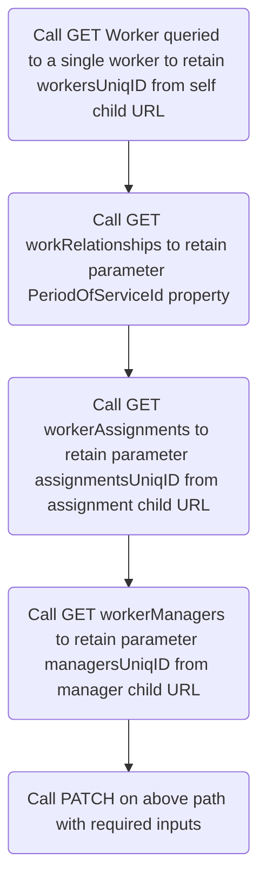

## Prerequisites

IBM Technologies

1. IBM watsonx Orchestrate with the "Builder" role

External Technologies
1. Oracle HCM Instance

    Including an Oracle HCM user account with:
        1. Username/Password
        2. API access with ability to perform GET and PATCH calls to "workers" API, and GET calls to "publicWorkers" API
        3. The ability to create Workers
2. Custom code engine to perform the patch function
    :::warning Custom Code Required
    Custom code is required to update a manager via a PATCH call due to Oracle HCM's specific PATCH parameter requirements and JSON response structure. watsonx Orchestrate cannot natively parse these unique IDs from the Oracle HCM JSON response, as they are embedded within the string of the returned URL property, rather than being returned as individual properties.

    Two unique IDs are required as input parameters for the "Update a Manager" PATCH call: `workersUniqID` and `assignmentsUniqID`. Refer to the supporting [Oracle documentation](https://docs.oracle.com/en/cloud/saas/human-resources/24b/farws/Update_a_Worker_Manager.html) for more details. In the Oracle HCM response, the URL properties contain these unique IDs as part of the string, but only the unique ID portion is needed for the PATCH call to function correctly. Since watsonx Orchestrate cannot isolate portions of string properties to pass as output variables, it cannot directly use them as input parameters for the PATCH call.

    To resolve this, custom code is used. This code takes user input via watsonx Orchestrate's AI assistant, parses the Oracle HCM JSON response, and extracts the necessary unique IDs. These IDs are then retained as variables to be passed as parameters in the PATCH call, enabling the proper update of a manager.
    :::

## Quickstart

This "Quickstart" provides an importable watsonx assistant with two custom extensions to provide this functionality within watsonx Orchestrate AI Assistant and/or watsonx Assistant for Oracle HCM. The below guide is how to build and configure the assistant.

### Overview
1. Download and Import the prebuilt watsonx Orchestrate AI Assistant
2. Download and Import the OracleHCM Skill/Custom Extensions into watsonx Orchestrate AI Assistant
3. Stage the "Apply Manager Update Patch" Custom Code Environment
4. Stage Oracle HCM and the watsonx Orchestrate AI Assistant
5. Configure Action Step Extensions

#### Download and Import the prebuilt watsonx Orchestrate AI Assistant
1. Download the [zip file for the Assistant](https://github.com/ibm-client-engineering/solution-askhr/raw/refs/heads/main/assets/usecases/updatemanager/OracleHCM/Assistants/Oracle%20HCM%20Update%20Manager%20Assistant.zip)
2. Upload the zip file to your watsonx Orchestrate Assistant (If no assistant exists, create one. Feel free to name it anything such as "AskHR Bot")
    1. Go to Assistant settings
    2. Click the "Download/Upload" box
    3. Click Upload
    4. Navigate to the downloaded zip file from the previous step
    5. Click "Upload"

#### Download and Import the OracleHCM Skill/Custom Extensions into watsonx Orchestrate AI Assistant
1. Download the watsonx Orchestrate custom extension [Oracle - Get Managers and Employees](https://github.com/ibm-client-engineering/solution-askhr/raw/refs/heads/main/assets/usecases/updatemanager/OracleHCM/Skills/Oracle%20-%20Get%20Managers%20and%20Employees.json)
2. Modify the API spec for `Oracle HCM` custom extension and replace "YOUR_INSTANCE_HERE" with your Oracle HCM instance name

    ```json
    "servers": [
        {
          "url": "https://YOUR_INSTANCE_HERE.oraclecloud.com/",
          "description": "HCM API server"
        }
    ]
    ```

3. Upload the "Oracle - Get Managers and Employees" custom extension
    1. Go to integrations
    2. Click "Build Custom Extension"
    3. Click "Next"
    4. Name the extension "Oracle - Get Managers and Employees"
    5. Navigate to the downloaded json file from the previous step
    6. Click "Finish"

4. Add and Authenticate the "Oracle - Get Managers and Employees" custom extension
    1. From your list of extensions under "Integrations, select the created custom extension from above
    2. Click "Add"
    3. Click "Add"
    4. Click "Next"
    5. Under "Authentication Type," select "Basic Auth" 
    6. Enter your Oracle HCM username and password
    7 .Click "Next"
    8. Click "Finish"

5. Download the watsonx Orchestrate custom extension [Apply Manager Update Patch](https://github.com/ibm-client-engineering/solution-askhr/raw/refs/heads/main/assets/usecases/updatemanager/OracleHCM/Skills/Apply%20Manager%20Update%20Patch.json)

6. Modify the API spec for `Apply Manager Update Patch` and replace "YOUR_INSTANCE_HERE" with your custom code endpoint URL

    ```json
    servers": [
      {
        "url": "https://YOUR_INSTANCE_HERE/updateManager"
      }
    ]  
    ```

7. Upload the "Apply Manager Update Patch" custom extension
    1. Go to integrations
    2. Click "Build Custom Extension"
    3. Click "Next"
    4. Name the extension "Apply Manager Update Patch"
    5. Navigate to the downloaded json file from the previous step
    6. Click "Finish"

8. Add the "Apply Manager Update Patch" custom extension
    1. From your list of extensions under "Integrations, select the created custom extension from above
    2. Click "Add"
    3. Click "Add"
    4. Click "Next"
    5. Click "Finish"

#### Stage the "Apply Manager Update Patch" Custom Code Environment

TBD


#### Stage Oracle HCM and the watsonx Orchestrate AI Assistant
1. In Oracle HCM, create managers and their direct reports
2. For each manager, retain their respective PersonID. This documentation will refer to them as `Manager 1` and `Manager 2`
3. Ensure each manager has at least one direct report.

:::tip Example
Our assistant assumed the following users and reports in Oracle HCM:

1. John Doe (`Manager 1`, PersonID 300000009897423), with direct reports Tom Smith and Alice Brown
2. Taylor Jones (`Manager 2`, PersonID 300000009928463), with direct report Sam Wiliams
:::

2. In the watsonx Orchestrate AI assistant, set the manager context variables. The `ContextManager` variable represents the PersonID of the manager as the Assistant user. This will allow you to switch the context of the user between `Manager 1` and `Manager 2`
    1. Go to "Actions"
    2. Under "Variables" select "Created by you"
    3. Click the "ContextManager" variable
    4. Set the initial value to the PersonID of your `Manager 1`
    5. Click "Save"
3. Update the Names and PersonID's for each manager variable
    1. Go to "Actions"
    2. Under "Variables" select "Created by you"
    3. Click the "Manager1" variable
    5. Set the initial value to the PersonID of your `Manager 1`
    6. Click "Save"
    7. Click the "Manager2" variable
    9. Set the initial value to the PersonID of your `Manager 2`
    10. Click "Save"

#### Configure Action Steps Extensions

1. Navigate to the Assistant actions
2. Click "Created by you"
3. Click action "Update Manager"
4. Select Action Step 5
5. Click "Edit Extension"
6. Under "Extension," select "Oracle - Get Managers and Employees" from the dropdown
7. Under "Operations," select "Get Direct Reports of PersonID"
8. Under "Parameters," set "PersonID" to Session Variables > "ContextManager".
9. Under "Optional Parameters," set "fields" to an expression 
10. In the expression, type the following:
    ```
    assignments.directReports:PersonId,DisplayName
    ```
    :::warning
    There is a bug in watsonx Orchestrate where you must click and set the optional parameter even if it appears to be set by default in the json. Make sure you do the above step and hit apply anyway.
    :::
11. Under "Optional Paremeters," set "onlyData" to "True". 
    :::warning
    This parameter will appear to be set. Click and apply anyway.
    :::
12. Click "Save"
13. Select Action Step 8
14. Click "Edit Extension"
15. Under "Extension," select "Oracle - Get Managers and Employees" from the dropdown
16. Under "Operations," select "Get New Manager's Assignment Number"
17. Under "Optional Paremeters," set "q" to an expression
18. In the expression, type the following:
    ```
    "DisplayName=
    ```
19. After "DisplayName= press the spacebar then type the `$` character. Select "Session Variables"
20. Select Session Variable "selectedEmployee"
21. Type the `"` character
22. Press the left arrow key three times to direct the text cursor before the "selectedEmployee" variable in Builder
23. Press backspace to delete the space between the "selectedEmployee" variable and ""Direct Reports="
24. The expression should look like the following (including quotations):
    ```
    "DisplayName=selectedEmployee"
    ```
25. Click "Apply"
26. Under "Optional Paremeters," set "fields" to expression "PersonID" (replace "assignments:AssignmentNumber" with "PersonID", without quotes)
    ```
    PersonID
    ```
27. Click "Apply"
28. Under "Optional Paremeters," set "onlyData" to "True". 
    :::warning
    This parameter will appear to be set. Click and apply anyway.
    :::
29. Click Apply
30. Select Action Step 11
31. Click "Edit Extension"
32. Under "Extension," select "Oracle - Get Managers and Employees" from the dropdown
33. Under "Operations," select "Get New Manager's Assignment Number"
34. Under "Optional Paremeters," set "q" to an expression
35. In the expression, type the following:
    ```
    "DisplayName=
    ```
36. After "DisplayName= press the spacebar then type the `$` character. Select "Action Steps"
37. Select Action Step Variable "10. Who is the new manager..."
38. Type the `"` character
39. Press the left arrow key three times to direct the text cursor before the "selectedEmployee" variable
40. Press backspace to delete the space between the "selectedEmployee" variable and ""Direct Reports="
41. The expression should look like the following (including quotations):
    ```
    "DisplayName=10. Who is the new manager..."
    ```
42. Click "Apply"
43. Under "Optional Paremeters," set "fields" to expression "assignments:AssignmentNumber"
    :::warning
    This parameter will appear to be set. Click and apply anyway.
    :::
44. Under "Optional Paremeters," set "onlyData" to "True". 
    :::warning
    This parameter will appear to be set. Click and apply anyway.
    :::
45. Select Action Step 17
46. Click "Edit Extension"
47. Under "Extension," select "Apply Manager Update Patch" from the dropdown
48. Under "Operations," select "Patch manager details using a dynamic path"
49. Under "Optional Paremeters," set "path" to an expression
50. In the expression, type the following:
    ```
    "PersonId/
    ```
51. After "PersonId/ press the spacebar then type the `$` character. Select "Session Variables"
52. Select Session Variable "selectedPersonId"
53. Press the left arrow key **two** times to direct the text cursor before the "selectedPersonId" variable
54. Press backspace to delete the space between the ""PersonId/" and "selectedPersonId" variable
55. Click the open space after the "selectedPersonId" variable to move the text curser after the "selectedPersonId" variable
56. Type the following:
    ```
    /managerAssignmentNumber/
    ```
57. After /managerAssignmentNumber/ press the spacebar then type the `$` character. Select "Session Variables"
58. Select Session Variable "newManagerAssignmentNumber"
59. Press the left arrow key **two** times to direct the text cursor before the "newManagerAssignmentNumber" variable
60. Press backspace to delete the space between the "managerAssignmentNumber/" and "newManagerAssignmentNumber" variable
61. 3The expression should look like the following (including quotations):
    ```
    "PersonId/selectedPersonId/managerAssignmentNumber/newManagerAssignmentNumber"
    ```
62. Click Apply

You are now ready to test the Assistant.

To assume the role of `Manager 1`, type in the assistant "Context switch to manager 1"
To assume the role of `Manager 2`, type in the assistant "Context switch to manager 2"

## Further Documentation

### Oracle Documentation

["Update a Worker Manager" documentation](https://docs.oracle.com/en/cloud/saas/human-resources/24b/farws/Update_a_Worker_Manager.html)

### Oracle HCM API Flow Overview

Each PATCH for "Update an Employee Manager" requires following parameters:
1. `EmployeeID` (Parsed from GET worker call - ID located in the "self" child URL, and returns multiple workers unless a query parameter is used)
2. `PeriodOfServiceId` (Using the workersUniqID parameter above, property is directly returned by the GET worker workRelationships call, in the workRelationships child)
3. `Worker Assignment` (Using the above 2 parameters, parsed from GET worker workRelationships call - ID located in the in the "assignments" child URL). These requirements accomplish "Transfer an Employee" with `PATCH Update a Worker Assignment`
4. `Worker Manager` (Using the above 3 parameters returns the workerManagers child). These requirements accomplish "Update a Worker Manager" with `PATCH Update a Worker Manager`.

Per the documentation, you must follow the chain of returns from the GET worker call, GET worker workRelationships call, and GET worker assignments call and retain the "uniqId" in the URL to pass to the required parameters for the PATCH calls (Update a Worker Assignment and Update a Worker Manager) API.



Via Manual Curls:
    1. Retrieve (GET) the worker details and obtain the manager item link.
        ```yaml
        # Used to GET worker info and child IDs (workersUniqID, PeriodOfServiceId, assignmentsUniqID)
        /hcmRestApi/resources/11.13.18.05/publicWorkers/{PersonId}
        # or
        /hcmRestApi/resources/11.13.18.05/workers/{PersonId}
        ```
        <details>
        <summary><b>Example Output</b></summary>
            ```json
            {
              "items": [
                {
                  "PersonId": 300000009681193,
                  "PersonNumber": "19",
                  "CorrespondenceLanguage": null,
                  "BloodType": null,
                  "DateOfBirth": null,
                  "DateOfDeath": null,
                  "CountryOfBirth": null,
                  "RegionOfBirth": null,
                  "TownOfBirth": null,
                  "ApplicantNumber": null,
                  "CreatedBy": "rkswain@in.ibm.com",
                  "CreationDate": "2024-08-18T08:19:18+00:00",
                  "LastUpdatedBy": "rkswain@in.ibm.com",
                  "LastUpdateDate": "2024-08-18T08:25:52.593+00:00",
                  "links": [
                    {
                      "rel": "self",
                      "href": "https://iavnqy-dev1.fa.ocs.oraclecloud.com:443/hcmRestApi/resources/11.13.18.05/workers/00020000000EACED00057708000110D9320279290000004AACED00057372000D6A6176612E73716C2E4461746514FA46683F3566970200007872000E6A6176612E7574696C2E44617465686A81014B5974190300007870770800000191E387980078",
                      "name": "workers",
                      "kind": "item",
                      "properties": {
                        "changeIndicator": "ACED0005737200136A6176612E7574696C2E41727261794C6973747881D21D99C7619D03000149000473697A65787000000002770400000002737200116A6176612E6C616E672E496E746567657212E2A0A4F781873802000149000576616C7565787200106A6176612E6C616E672E4E756D62657286AC951D0B94E08B0200007870000000027371007E00020000000178"
                      }
                    },
                    {
                      "rel": "canonical",
                      "href": "https://iavnqy-dev1.fa.ocs.oraclecloud.com:443/hcmRestApi/resources/11.13.18.05/workers/00020000000EACED00057708000110D9320279290000004AACED00057372000D6A6176612E73716C2E4461746514FA46683F3566970200007872000E6A6176612E7574696C2E44617465686A81014B5974190300007870770800000191E387980078",
                      "name": "workers",
                      "kind": "item"
                    },
                    {
                      "rel": "child",
                      "href": "https://iavnqy-dev1.fa.ocs.oraclecloud.com:443/hcmRestApi/resources/11.13.18.05/workers/00020000000EACED00057708000110D9320279290000004AACED00057372000D6A6176612E73716C2E4461746514FA46683F3566970200007872000E6A6176612E7574696C2E44617465686A81014B5974190300007870770800000191E387980078/child/addresses",
                      "name": "addresses",
                      "kind": "collection"
                    },
                    {
                      "rel": "child",
                      "href": "https://iavnqy-dev1.fa.ocs.oraclecloud.com:443/hcmRestApi/resources/11.13.18.05/workers/00020000000EACED00057708000110D9320279290000004AACED00057372000D6A6176612E73716C2E4461746514FA46683F3566970200007872000E6A6176612E7574696C2E44617465686A81014B5974190300007870770800000191E387980078/child/citizenships",
                      "name": "citizenships",
                      "kind": "collection"
                    },
                    {
                      "rel": "child",
                      "href": "https://iavnqy-dev1.fa.ocs.oraclecloud.com:443/hcmRestApi/resources/11.13.18.05/workers/00020000000EACED00057708000110D9320279290000004AACED00057372000D6A6176612E73716C2E4461746514FA46683F3566970200007872000E6A6176612E7574696C2E44617465686A81014B5974190300007870770800000191E387980078/child/disabilities",
                      "name": "disabilities",
                      "kind": "collection"
                    },
                    {
                      "rel": "child",
                      "href": "https://iavnqy-dev1.fa.ocs.oraclecloud.com:443/hcmRestApi/resources/11.13.18.05/workers/00020000000EACED00057708000110D9320279290000004AACED00057372000D6A6176612E73716C2E4461746514FA46683F3566970200007872000E6A6176612E7574696C2E44617465686A81014B5974190300007870770800000191E387980078/child/driverLicenses",
                      "name": "driverLicenses",
                      "kind": "collection"
                    },
                    {
                      "rel": "child",
                      "href": "https://iavnqy-dev1.fa.ocs.oraclecloud.com:443/hcmRestApi/resources/11.13.18.05/workers/00020000000EACED00057708000110D9320279290000004AACED00057372000D6A6176612E73716C2E4461746514FA46683F3566970200007872000E6A6176612E7574696C2E44617465686A81014B5974190300007870770800000191E387980078/child/emails",
                      "name": "emails",
                      "kind": "collection"
                    },
                    {
                      "rel": "child",
                      "href": "https://iavnqy-dev1.fa.ocs.oraclecloud.com:443/hcmRestApi/resources/11.13.18.05/workers/00020000000EACED00057708000110D9320279290000004AACED00057372000D6A6176612E73716C2E4461746514FA46683F3566970200007872000E6A6176612E7574696C2E44617465686A81014B5974190300007870770800000191E387980078/child/ethnicities",
                      "name": "ethnicities",
                      "kind": "collection"
                    },
                    {
                      "rel": "child",
                      "href": "https://iavnqy-dev1.fa.ocs.oraclecloud.com:443/hcmRestApi/resources/11.13.18.05/workers/00020000000EACED00057708000110D9320279290000004AACED00057372000D6A6176612E73716C2E4461746514FA46683F3566970200007872000E6A6176612E7574696C2E44617465686A81014B5974190300007870770800000191E387980078/child/externalIdentifiers",
                      "name": "externalIdentifiers",
                      "kind": "collection"
                    },
                    {
                      "rel": "child",
                      "href": "https://iavnqy-dev1.fa.ocs.oraclecloud.com:443/hcmRestApi/resources/11.13.18.05/workers/00020000000EACED00057708000110D9320279290000004AACED00057372000D6A6176612E73716C2E4461746514FA46683F3566970200007872000E6A6176612E7574696C2E44617465686A81014B5974190300007870770800000191E387980078/child/legislativeInfo",
                      "name": "legislativeInfo",
                      "kind": "collection"
                    },
                    {
                      "rel": "child",
                      "href": "https://iavnqy-dev1.fa.ocs.oraclecloud.com:443/hcmRestApi/resources/11.13.18.05/workers/00020000000EACED00057708000110D9320279290000004AACED00057372000D6A6176612E73716C2E4461746514FA46683F3566970200007872000E6A6176612E7574696C2E44617465686A81014B5974190300007870770800000191E387980078/child/messages",
                      "name": "messages",
                      "kind": "collection"
                    },
                    {
                      "rel": "child",
                      "href": "https://iavnqy-dev1.fa.ocs.oraclecloud.com:443/hcmRestApi/resources/11.13.18.05/workers/00020000000EACED00057708000110D9320279290000004AACED00057372000D6A6176612E73716C2E4461746514FA46683F3566970200007872000E6A6176612E7574696C2E44617465686A81014B5974190300007870770800000191E387980078/child/names",
                      "name": "names",
                      "kind": "collection"
                    },
                    {
                      "rel": "child",
                      "href": "https://iavnqy-dev1.fa.ocs.oraclecloud.com:443/hcmRestApi/resources/11.13.18.05/workers/00020000000EACED00057708000110D9320279290000004AACED00057372000D6A6176612E73716C2E4461746514FA46683F3566970200007872000E6A6176612E7574696C2E44617465686A81014B5974190300007870770800000191E387980078/child/nationalIdentifiers",
                      "name": "nationalIdentifiers",
                      "kind": "collection"
                    },
                    {
                      "rel": "child",
                      "href": "https://iavnqy-dev1.fa.ocs.oraclecloud.com:443/hcmRestApi/resources/11.13.18.05/workers/00020000000EACED00057708000110D9320279290000004AACED00057372000D6A6176612E73716C2E4461746514FA46683F3566970200007872000E6A6176612E7574696C2E44617465686A81014B5974190300007870770800000191E387980078/child/otherCommunicationAccounts",
                      "name": "otherCommunicationAccounts",
                      "kind": "collection"
                    },
                    {
                      "rel": "child",
                      "href": "https://iavnqy-dev1.fa.ocs.oraclecloud.com:443/hcmRestApi/resources/11.13.18.05/workers/00020000000EACED00057708000110D9320279290000004AACED00057372000D6A6176612E73716C2E4461746514FA46683F3566970200007872000E6A6176612E7574696C2E44617465686A81014B5974190300007870770800000191E387980078/child/passports",
                      "name": "passports",
                      "kind": "collection"
                    },
                    {
                      "rel": "child",
                      "href": "https://iavnqy-dev1.fa.ocs.oraclecloud.com:443/hcmRestApi/resources/11.13.18.05/workers/00020000000EACED00057708000110D9320279290000004AACED00057372000D6A6176612E73716C2E4461746514FA46683F3566970200007872000E6A6176612E7574696C2E44617465686A81014B5974190300007870770800000191E387980078/child/phones",
                      "name": "phones",
                      "kind": "collection"
                    },
                    {
                      "rel": "child",
                      "href": "https://iavnqy-dev1.fa.ocs.oraclecloud.com:443/hcmRestApi/resources/11.13.18.05/workers/00020000000EACED00057708000110D9320279290000004AACED00057372000D6A6176612E73716C2E4461746514FA46683F3566970200007872000E6A6176612E7574696C2E44617465686A81014B5974190300007870770800000191E387980078/child/photos",
                      "name": "photos",
                      "kind": "collection"
                    },
                    {
                      "rel": "child",
                      "href": "https://iavnqy-dev1.fa.ocs.oraclecloud.com:443/hcmRestApi/resources/11.13.18.05/workers/00020000000EACED00057708000110D9320279290000004AACED00057372000D6A6176612E73716C2E4461746514FA46683F3566970200007872000E6A6176612E7574696C2E44617465686A81014B5974190300007870770800000191E387980078/child/religions",
                      "name": "religions",
                      "kind": "collection"
                    },
                    {
                      "rel": "child",
                      "href": "https://iavnqy-dev1.fa.ocs.oraclecloud.com:443/hcmRestApi/resources/11.13.18.05/workers/00020000000EACED00057708000110D9320279290000004AACED00057372000D6A6176612E73716C2E4461746514FA46683F3566970200007872000E6A6176612E7574696C2E44617465686A81014B5974190300007870770800000191E387980078/child/visasPermits",
                      "name": "visasPermits",
                      "kind": "collection"
                    },
                    {
                      "rel": "child",
                      "href": "https://iavnqy-dev1.fa.ocs.oraclecloud.com:443/hcmRestApi/resources/11.13.18.05/workers/00020000000EACED00057708000110D9320279290000004AACED00057372000D6A6176612E73716C2E4461746514FA46683F3566970200007872000E6A6176612E7574696C2E44617465686A81014B5974190300007870770800000191E387980078/child/workRelationships",
                      "name": "workRelationships",
                      "kind": "collection"
                    },
                    {
                      "rel": "child",
                      "href": "https://iavnqy-dev1.fa.ocs.oraclecloud.com:443/hcmRestApi/resources/11.13.18.05/workers/00020000000EACED00057708000110D9320279290000004AACED00057372000D6A6176612E73716C2E4461746514FA46683F3566970200007872000E6A6176612E7574696C2E44617465686A81014B5974190300007870770800000191E387980078/child/workersDFF",
                      "name": "workersDFF",
                      "kind": "collection"
                    },
                    {
                      "rel": "child",
                      "href": "https://iavnqy-dev1.fa.ocs.oraclecloud.com:443/hcmRestApi/resources/11.13.18.05/workers/00020000000EACED00057708000110D9320279290000004AACED00057372000D6A6176612E73716C2E4461746514FA46683F3566970200007872000E6A6176612E7574696C2E44617465686A81014B5974190300007870770800000191E387980078/child/workersEFF",
                      "name": "workersEFF",
                      "kind": "collection"
                    }
                  ]
                }
              ],
              "count": 1,
              "hasMore": false,
              "limit": 25,
              "offset": 0,
              "links": [
                {
                  "rel": "self",
                  "href": "https://iavnqy-dev1.fa.ocs.oraclecloud.com:443/hcmRestApi/resources/11.13.18.05/workers",
                  "name": "workers",
                  "kind": "collection"
                }
              ]
            }
            ```
            </details>
            
    2. Perform a PATCH operation on this URL by providing the new manager information in the request body.
        ```yaml
        /hcmRestApi/resources/11.13.18.05/workers/{workersUniqID}/child/workRelationships/{PeriodOfServiceId}/child/assignments/{assignmentsUniqID}/child/managers/{managersUniqID}
        ```

Example PATCH request body to change an employee's manager:

```json
{
"ActionCode": "MANAGER_CHANGE",
"ManagerAssignmentNumber": "E955160008191552",
"ManagerType": "LINE_MANAGER"
}
```

Example Response from OracleHCM:

```json
{
"AssignmentSupervisorId": 598504,
"EffectiveStartDate": "2019-06-11",
"EffectiveEndDate": "4712-12-31",
"ManagerAssignmentId": 300100180052435,
"ManagerAssignmentNumber": "E955160008191552",
"ManagerType": "LINE_MANAGER",
"ActionCode": "MANAGER_CHANGE",
"ReasonCode": null,
"CreatedBy": "HCM_INTEGRATION_SPEC",
"CreationDate": "2019-06-07T15:36:27.784+00:00",
"LastUpdatedBy": "HCM_INTEGRATION_SPEC",
"LastUpdateDate": "2019-06-11T18:34:58.437+00:00",
"links": [...]
}
```